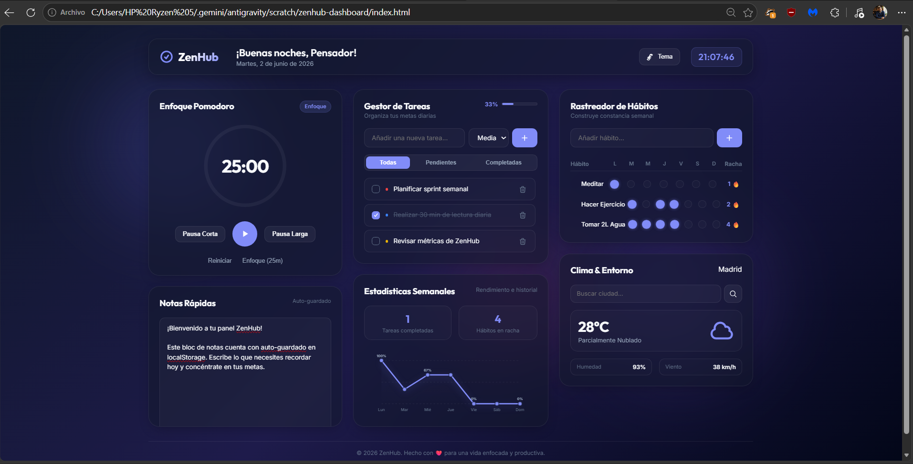

<div align="center">

  
  

  # 🎯 ZenHub Dashboard
  **Panel de productividad integral con Pomodoro, gestor de tareas, rastreador de hábitos y clima en tiempo real**

</div>

---

## 📸 Vista Previa



---

## ✨ Características

| Característica | Descripción |
|---|---|
| ⏱️ **Pomodoro Inteligente** | Técnica de 25 minutos con pausas configurables |
| 📋 **Gestor de Tareas** | Crear, editar y eliminar tareas en tiempo real con niveles de prioridad |
| 🎯 **Rastreador de Hábitos** | Seguimiento semanal con cálculo automático de rachas |
| 🌤️ **Clima en Vivo (Open-Meteo)** | Información meteorológica y geocodificación gratuita sin API key |
| 📊 **Estadísticas** | Gráficas semanales de rendimiento interactivas |
| 🎨 **Temas Personalizados** | Selector de 4 temas dinámicos (Dark Glass, Emerald, Sunset, Frost) |
| 💾 **Persistencia** | Guarda automáticamente todo el estado en localStorage |

---

## 🚀 Instalación

### Opción 1: Navegador Directo (⚡ Recomendado)

```bash
# Solo requiere un navegador moderno
# Navegadores soportados: Chrome 90+, Firefox 88+, Safari 14+, Edge 90+

# 1. Clona el repositorio
git clone https://github.com/Lucas18062025/zenhub-dashboard.git

# 2. Abre el archivo en tu navegador
index.html  # ← Double-click o arrastra al navegador
```

### Opción 2: Servidor Local (Python)

```bash
# Si tienes Python instalado
cd zenhub-dashboard
python -m http.server 8000

# Luego abre en tu navegador:
# http://localhost:8000
```

### Opción 3: Live Server (VS Code)

```bash
# Con la extensión "Live Server" instalada
# Click derecho en index.html → Open with Live Server
```

---

## 📂 Estructura del Proyecto

<pre style="background: #0d1117; padding: 16px; border-radius: 8px; overflow-x: auto; border: 1px solid #30363d;">
<code style="color: #c9d1d9; font-family: monospace;">
📁 <strong>zenhub-dashboard/</strong>
  ├─ 📁 assets/             <span style="color: #7ee787;">Recursos visuales (preview.png)</span>
  ├─ 📄 index.html          <span style="color: #7ee787;">Estructura HTML5 semántica</span>
  ├─ 🎨 style.css           <span style="color: #7ee787;">Estilos CSS3 con temas dinámicos (UTF-8)</span>
  ├─ ⚙️  app.js              <span style="color: #7ee787;">Lógica JS y cliente Open-Meteo</span>
  ├─ ⚙️  .editorconfig       <span style="color: #7ee787;">Configuración de codificación y estilo</span>
  ├─ ⚙️  .gitattributes      <span style="color: #7ee787;">Reglas de codificación UTF-8 para Git</span>
  └─ 📖 README.md           <span style="color: #7ee787;">Documentación del proyecto</span>
</code>
</pre>

---

## 💡 Cómo Usar

### Pomodoro
1. Presiona **"Enfoque (25m)"** para comenzar la sesión de trabajo.
2. Utiliza **"Pausa Corta"** (5m) o **"Pausa Larga"** (15m) según tus necesidades.
3. Pausa o reinicia la cuenta en cualquier momento.

### Tareas
1. Escribe el nombre de la tarea, selecciona la prioridad (Baja, Media, Alta) y presiona **+**.
2. Filtra por **Todas**, **Pendientes** o **Completadas**.
3. Marca la casilla para completar la tarea o presiona el ícono de papelera para eliminarla.

### Hábitos
1. Agrega el hábito que deseas cultivar.
2. Marca los días transcurridos de la semana (Lunes a Domingo) para actualizar tu racha.

### Clima (Open-Meteo API)
1. Escribe el nombre de tu ciudad en el campo de búsqueda del widget de Clima.
2. La aplicación utiliza la **Geocoding API de Open-Meteo** para encontrar la latitud y longitud sin requerir API Key.
3. Obtiene la temperatura actual, condición meteorológica (interpretando códigos WMO), humedad y velocidad del viento.

---

## 🎨 Stack Tecnológico

**Frontend:**
- HTML5 Semántico
- CSS3 (Variables CSS, Flexbox, Grid, Glassmorphism, UTF-8)
- Vanilla JavaScript (ES6+, Async/Await, Fetch API)

**Almacenamiento:**
- LocalStorage API (Persistencia de estado y preferencias)

**APIs Externas:**
- **Open-Meteo Forecast & Geocoding API** (Clima en tiempo real y geolocalización gratuita sin API Key)

---

## 📋 Roadmap

### 🚀 Características Completadas
- [x] Selector de temas dinámico (Glassmorphic Dark, Emerald Calm, Sunset Aurora, Frost Light)
- [x] Integración de clima en tiempo real sin API Key (Open-Meteo API & Geocoding)
- [x] Temporizador Pomodoro interactivo con sonido de campana Zen (Web Audio API)
- [x] Gestor de tareas con prioridades y filtros (Todas, Pendientes, Completadas)
- [x] Rastreador de hábitos con cálculo automático de rachas
- [x] Bloc de notas rápido con auto-guardado en LocalStorage
- [x] Gráfica de rendimiento e historial semanal en SVG dinámico
- [x] Estandarización de codificación UTF-8 y configuración `.editorconfig` / `.gitattributes`
- [x] Exportación e importación de tareas y datos en formato JSON y CSV
- [x] Generación y exportación de reporte diario de productividad a PDF (`html2pdf.js`)

### 🔮 Próximas Funcionalidades
- [ ] Sincronización opcional con Google Calendar
- [ ] Notificaciones sonoras personalizables y notificaciones nativas del navegador
- [ ] Soporte offline completo y PWA (Progressive Web App)
- [ ] Integración con Slack / Discord mediante Webhooks
- [ ] Integración con Slack / Discord mediante Webhooks

---

## 👨‍💻 Autor

**Lucas Villagra**  
Analista de Ciberseguridad | Ethical Hacker  
San Miguel de Tucumán, Argentina  

🔗 [GitHub](https://github.com/Lucas18062025) | [LinkedIn](https://linkedin.com/in/lucas-villagra-cybersecurity)  

---

<div align="center">

**Hecho con ❤️ para una vida más productiva y segura**

</div>
